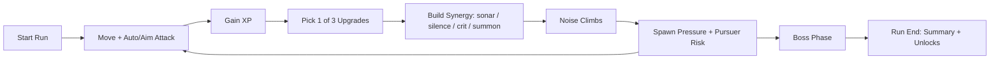

# Survive: Neon Sonar (Godot 4.x)

在黑暗深海里生存：你依赖短暂声呐获取信息，但每次攻击、冲刺与技能都会抬高噪声，噪声越高，敌潮越凶。

## Why It Stands Out
- **信息不是常量**：默认迷雾视野，必须主动“制造信息”（声呐揭示）。
- **输出有代价**：高火力会抬噪，直接推高刷怪与追猎者压力。
- **开局风险交易**：0–3 契约叠加，换取 XP / 稀有度 / 掉落收益。
- **构筑偏置明确**：角色 `tag_weights` + 升级规则（稀有度/前置/互斥）决定流派。
- **可复盘可调参**：固定 seed、全数据配置、热重载与 Debug 面板。

## Quick Start
### 运行（编辑器）
1. 使用 Godot `4.2+` 打开项目目录。
2. 主场景：`res://scenes/game/GameRoot.tscn`。
3. 点击 Play。

### 运行（CLI）
```bash
godot --path .
```

### 自动化测试（headless）
```bash
godot --headless --path . res://tests/TestRunner.tscn --quit-after 3600
```

推荐使用统一入口脚本（本地/CI 一致）：
```bash
./scripts/ci/run_headless_tests.sh
```

仅做导入预热（CI 可单独执行）：
```bash
godot --headless --path . --import
```

### 构建导出（macOS / Windows）
仓库已提交 `export_presets.cfg`。若本地首次打开看不到预设，按以下步骤创建：
1. 打开 Godot 编辑器，进入 `Project -> Export...`。
2. 点击 `Add...`，选择 `macOS`，预设名设为 `macOS`。
3. `Export Path` 填写为 `exports/macos/Survive-Neon-Sonar.app`。
4. 保存后确认项目根目录生成/更新 `export_presets.cfg`。

```bash
godot --headless --path . --export-release "macOS" exports/macos/Survive-Neon-Sonar.app
godot --headless --path . --export-release "Windows Desktop" exports/NeonSonar.exe
```

## macOS Release Artifacts

### 1) 导出 `.app`
```bash
godot --headless --path . --export-release "macOS" exports/macos/Survive-Neon-Sonar.app
```

### 2) 打包 DMG（App + Applications alias）
```bash
./scripts/build_macos_dmg.sh exports/macos/Survive-Neon-Sonar.app
```

默认输出：`dist/Survive-Neon-Sonar-macOS.dmg`

### 3) 验证 DMG 结构
```bash
./scripts/verify_macos_artifacts.sh dist/Survive-Neon-Sonar-macOS.dmg
```

验证项：
- DMG 可挂载
- 根目录包含 `.app`
- 根目录包含 `Applications` alias/link
- DMG 内无 `.command` 文件

### 4) macOS 用户安装
1. 双击 `dist/Survive-Neon-Sonar-macOS.dmg` 挂载。
2. 将 `Survive-Neon-Sonar.app` 拖到 `Applications`。
3. 从 `Applications` 启动游戏。

## Gameplay Loop


## Core Controls
- `WASD / Arrow`: 移动
- `Space / Shift`: 冲刺
- `Q / E`: 主动声呐技能
- `Tab`: 自动攻击 / 指向攻击切换
- `F1`: Debug 面板
- `F2`: Fog 开关
- `F3`: Sonar 视觉开关
- `F5`: 调试热重载数据

## Current M3 Snapshot
- 角色：5（含解锁条件、起始武器与被动）
- 武器：8（projectile / pulse / mine / beam / drone / melee）
- 升级：31（含稀有度、前置、互斥、武器/Tag定向）
- 地图：2（各自危害与事件表）
- 敌人：10+ 普通 + 6 精英词缀 + 追猎者 + 1 两阶段 Boss
- 契约：12（开局 0–3 选择，奖励预览与参数联动）

## Design Notes
为什么这款游戏和 VS/Brotato 节奏相近但机制体验不同：
- 关键差异轴是 **视野/信息** 与 **噪声代价**，不是单纯数值膨胀。
- 高伤害与高安全不能长期共存，玩家持续在“输出效率 vs 暴露风险”间做选择。

详细说明见：[`docs/DESIGN_NOTES.md`](docs/DESIGN_NOTES.md)

## Media Kit
- 录屏脚本与流程：[`media/TRAILER_CAPTURE.md`](media/TRAILER_CAPTURE.md)
- 截图拍摄清单：[`media/SHOTLIST.md`](media/SHOTLIST.md)

## Data-Driven Tuning Entry
- 角色：`data/characters.json`
- 武器：`data/weapons.json`
- 升级：`data/upgrades.json`
- 地图/危害/事件：`data/maps.json` / `data/hazards.json` / `data/events.json`
- 敌人/精英/Boss：`data/enemies.json` / `data/elites.json` / `data/bosses.json`
- 契约：`data/contracts.json`
- 迷雾/声呐/噪声：`data/fog.json` / `data/sonar.json` / `data/noise.json`

## Repo Structure
- `scenes/`：场景层（GameRoot / World / UI / Entities）
- `scripts/`：核心逻辑、系统模块、UI 控制器
- `data/`：所有可调配置（JSON）
- `tests/`：`TestRunner.tscn` + 回归测试
- `assets/`：占位素材（可替换）
- `exports/`：导出产物目录
- `media/`：录屏与截图制作文档

## License & Credits
- License：[`LICENSE`](LICENSE)
- Third-party / asset credits：[`CREDITS.md`](CREDITS.md)
